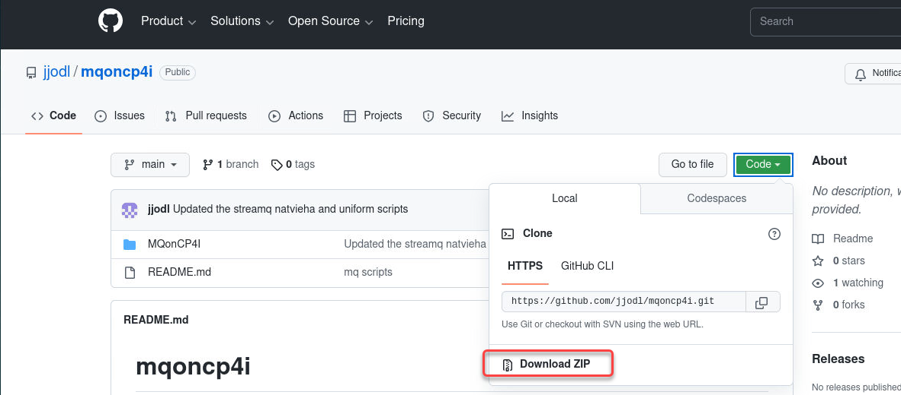
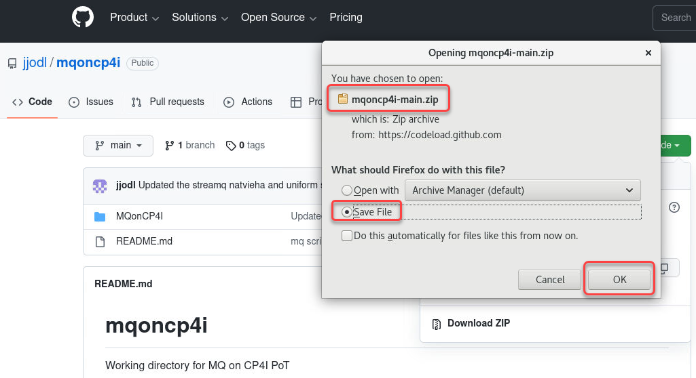
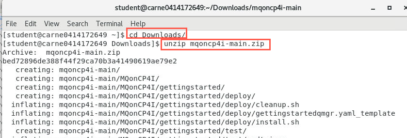

# Setup environment for MQ CP4I PoT
# Table of Contents 
- [1. Download artifacts for MQ on CP4I](#download-artifacts-for-mq-on-cp4i-pot)
- [2. Connecting MQ Explorer to a deployed Queue Manager in OpenShift](#connecting-mq-explorer-to-a-deployed-queue-manager-in-openshift)
- [3. IBM Only - Create Project (namespace) for your lab assets](#ibm-only---create-project-namespace-for-your-lab-assets)


<a name="download"></a>	
## Download artifacts for MQ on CP4I PoT

You should be logged on your VDI as *student*. 

1. Open a Firefox browser tab and navigate to [Github MQonCP4i](https://github.com/jjodl/mqoncp4i).

	
	
1. Click *Code* and select *Download zip*.

	

1. Click *Save file* radio button then click *OK*.

	
	
1. Open a terminal window by double-clicking the icon on the desktop.

	
	
1. Enter the following command to see the zip file you just downloaded.

	```
	cd Downloads
	```
	
1. Enter the following command to unzip the downloaded file:

	```
	unzip mqoncp4i-main.zip
	```
	
	
	
1. Move the unzipped directory to your home directory with the following command:
	
	```
	cd mqoncp4i-main
	```
	
	```
	mv MQonCP4I/ ~/
	```
	
	 
	
	This will create the directory **/home/student/MQonCP4I**.  Change to your home directory and list the contents of the directory to verify that it contains *MQonCP4I*. 
	
	```sh
	cd ~/MQonCP4I
	ls -l 
	```
1. Now first we will need to change the mode to executable for all the scripts.   From the MQonCP4I directory run the following command.

	```
	find . -type f -iname "*.sh" -exec chmod +x {} \;
	```
	


9. Now we will change to the **setup** directory to run the script that will create all the install scripts for your userid.  
	
	```sh
	cd setup
	ls -l 
	```
	
	

1. 	Now run the MQ_script_setup.sh You will use your student id that was given to you from the instructor.

**Note:** In this example we are user palpatine5 so would use that as the namespace and 05 as the student id.


	
Great! You are now ready to start working with MQ in the labs. If running a PoT, attendees are now ready to start Lab 1 where they will create queue managers using their assigned IDs.

[Continue to Lab 1](../Lab_3/mq_cp4i_pot_lab3.md#introduction)

[Return MQ CP4I Menu](../index.md#introduction)